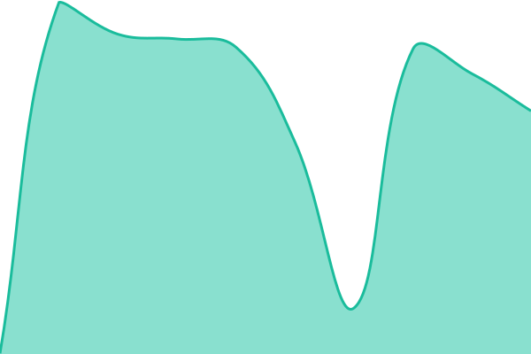
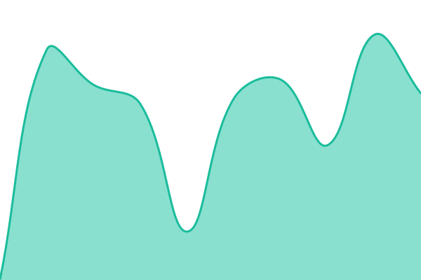
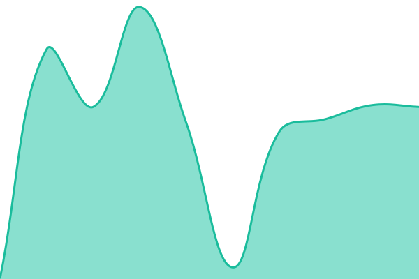

# [📈 Live Status](https://status.kryptonote.com): <!--live status--> **🟩 All systems operational**

This repository contains the open-source uptime monitor and status page for [Kryptonote Labs](https://status.kryptonote.com), powered by [Upptime](https://github.com/upptime/upptime).

With [Upptime](https://upptime.js.org), you can get your own unlimited and free uptime monitor and status page, powered entirely by a GitHub repository. We use [Issues](https://github.com/Kryptonote-Labs/status.kryptonote.com/issues) as incident reports, [Actions](https://github.com/Kryptonote-Labs/status.kryptonote.com/actions) as uptime monitors, and [Pages](https://status.kryptonote.com) for the status page.

<!--start: status pages-->
<!-- This summary is generated by Upptime (https://github.com/upptime/upptime) -->
<!-- Do not edit this manually, your changes will be overwritten -->
<!-- prettier-ignore -->
| URL | Status | History | Response Time | Uptime |
| --- | ------ | ------- | ------------- | ------ |
|  [Kryptonote Frontend](https://www.kryptonote.com) | 🟩 Up | [kryptonote-frontend.yml](https://github.com/Kryptonote-Labs/status.kryptonote.com/commits/HEAD/history/kryptonote-frontend.yml) | 

 1267ms
     
 | 

<a href="https://status.kryptonote.com/history/kryptonote-frontend">100.00%</a>
    

|  [Kryptonote File Upload](https://api.kryptonote.com) | 🟩 Up | [kryptonote-file-upload.yml](https://github.com/Kryptonote-Labs/status.kryptonote.com/commits/HEAD/history/kryptonote-file-upload.yml) | 

 437ms
     
 | 

<a href="https://status.kryptonote.com/history/kryptonote-file-upload">100.00%</a>
    

|  [Kryptonote Artefacts](https://artefacts.kryptonote.com/health) | 🟩 Up | [kryptonote-artefacts.yml](https://github.com/Kryptonote-Labs/status.kryptonote.com/commits/HEAD/history/kryptonote-artefacts.yml) | 

 606ms
     
 | 

<a href="https://status.kryptonote.com/history/kryptonote-artefacts">100.00%</a>
    

|  [Kryptonote AI](http://s-p-ai-01.kryptonote.com) | 🟩 Up | [kryptonote-ai.yml](https://github.com/Kryptonote-Labs/status.kryptonote.com/commits/HEAD/history/kryptonote-ai.yml) | 

 440ms
     
 | 

<a href="https://status.kryptonote.com/history/kryptonote-ai">100.00%</a>
    

|  [Convex](https://convex.kryptonote.com) | 🟩 Up | [convex.yml](https://github.com/Kryptonote-Labs/status.kryptonote.com/commits/HEAD/history/convex.yml) | 

 443ms
     
 | 

<a href="https://status.kryptonote.com/history/convex">100.00%</a>
    

<!--end: status pages-->

[**Visit our status website →**](https://status.kryptonote.com)

## 📄 License

- Powered by: [Upptime](https://github.com/upptime/upptime)
- Code: [MIT](./LICENSE) © [Anand Chowdhary](https://anandchowdhary.com), supported by [Pabio](https://pabio.com)
- Data in the `./history` directory: [Open Database License](https://opendatacommons.org/licenses/odbl/1-0/)
